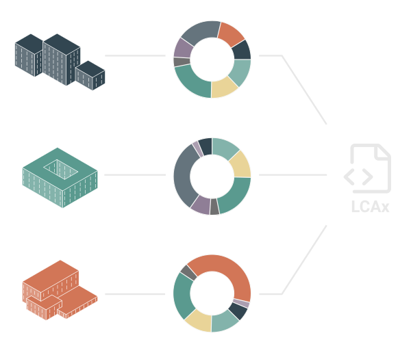

# LCAx

The goal for LCAx is to make an open, machine and human-readable data format for exchanging LCA results,
EPD's and assemblies.

We propose a simple three level data format with information on project, assembly and EPD level,
written in an open data format and paired with a validator for a more robust and standardized format.
We intend to create connections to existing tools and API’s.

Our goal is making LCA calculations more accessible, transparent, and open.



# Rust

## Install Rust
Head over to Rust's installation [page](https://www.rust-lang.org/tools/install)

## Install Rust Dependencies
```bash
cargo update
```

## Run Rust Tests

```bash
cargo test --package lcax --target x86_64-unknown-linux-gnu
```

## Export JSON Schema
```bash
cargo run --target x86_64-unknown-linux-gnu --bin export-schema > lcax.schema.json
```

# Python

## Install Python Dependencies
```bash
pip install maturin venv
```

## Run Python Tests

```bash
maturin develop --extras tests,codegen --target x86_64-unknown-linux-gnu
source .venv/bin/activate .

datamodel-codegen \
--input lcax.schema.json \
--output packages/python/src/lcax/pydantic.py
          
cd packages/python
pytest tests/
```

## Build Documentation

```bash
maturin develop --extras doc --target x86_64-unknown-linux-gnu
mkdocs serve
```

# JavaScript/TypeScript

## Build JS Package

```bash
wasm-pack build --features jsbindings
mv pkg/lcax* packages/javascript/src
```

## Run JS Tests
```bash
npm run test
```