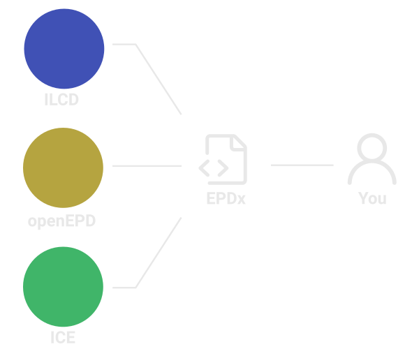

## LCAxProject

The project is the top level format that contains information such as name, description, etc.
It also includes information about what life cycle stages and impact categories should be calculated for the project.
Besides that it includes a list of parts (LCAxAssembly items) that make up the project.
Finally, if the project is already calculated then it includes the top level results.

## LCAxAssembly

LCAxAssembly is a format for assemblies/aggregates/build-ups/parts/components.
It is what makes up a project, and it brings together several EPDs in a single unit.
It carries a series of additional data points to elaborate on the EPDs and make them Assembly-specific,
without changing the EPD.

If the project is already calculated then it includes the environmental impact results.

## EPDx

EPDs is the lowest level of the hierarchy. EPDs contain all the environmental data that is needed to calculate the LCA.
EPDs come in many data formats e.g. ILCD+EPD and PDF, and it is not our intention to replace those formats but meanly
create an exchange format that is easily human and machine-readable.
Besides being a format EPDx is a library for parsing other formats.

The first beta version of EPDx can be found [here](https://epdx.kongsgaard.eu)